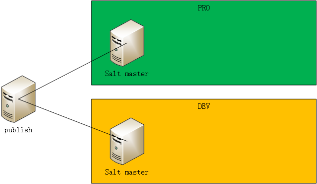

# publish

#### 项目介绍
发布系统

#### 软件架构
软件架构说明
1. 前后端分离
2. saltstack支持底层架构

#### 安装教程

1. pip install -r requirements.txt
2. 安装mysql数据库
3. 安装rabbitmq
4. 修改settings配置，对应自己的环境

#### 认证说明

1. 可以开启django数据库认证
2. 可以开启ldap认证

### 功能说明
1. 单业务部署
2. 串行业务部署
3. 并行业务部署
4. 工作流业务部署

### 将来功能
1. 整合ansible，可选底层架构支撑
2. 整合cmdb
3. 整合监控
4. 整合告警平台
